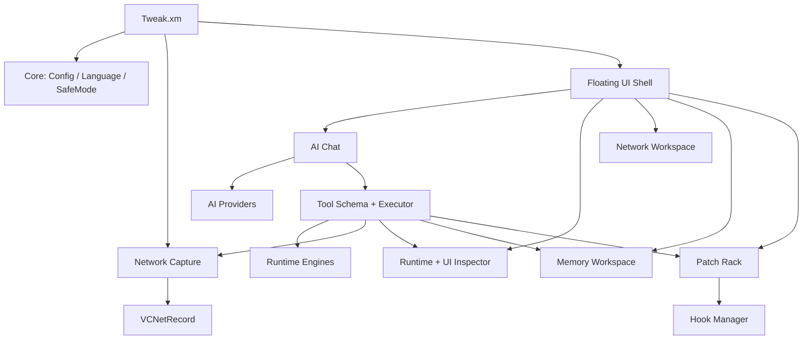
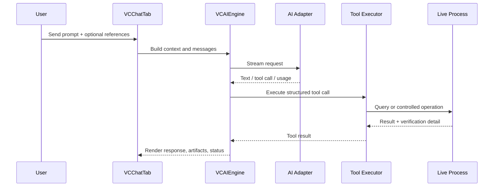

# Architecture

VansonCLI is a Theos tweak that injects a compact runtime workspace into a target iOS app. The project is organized around one shared idea: expose live process state as structured tools that can be used by both the UI and the AI assistant.

## Module Map

## Startup Flow

1. `Tweak.xm` waits for `UIApplicationDidFinishLaunchingNotification`.
2. `VCSafeMode` marks launch start and checks crash recovery state.
3. `VCConfig` prepares the sandbox paths and version metadata.
4. `VCNetMonitor` starts supported network capture hooks.
5. `VCFloatingButton` shows the entry point after the target app settles.

## AI Flow

## Network Flow

- `VCNetMonitor` coordinates URLSession, URLProtocol, delegate, and WebSocket capture paths.
- `VCNetRecord` stores method, URL, query, request headers, request body, response headers, response body, timing, status, and matching metadata.
- `VCNetworkTab` renders list filters, modal tabs, formatted params, request replay editors, favorites, rules, and HAR export.
- Replay data is shown in editable text controls so operators can adjust headers, params, and body before sending.

## UI Inspector Flow

- `VCUIInspector` reads live UIKit hierarchy and selected view details.
- `VCTouchOverlay` supports touch picking and optional visual highlight borders.
- `VCUIInspectorTab` presents hierarchy, selected view data, editable properties, and chat queue handoff.
- AI tools can query hierarchy, selected view, constraints, accessibility, responder chain, interactions, and screenshots.

## Memory and Patch Flow

- `VCMemoryScanEngine` scans and refines candidate values.
- `VCMemoryBrowserEngine` previews memory around addresses.
- `VCMemoryLocatorEngine` helps locate related addresses.
- `VCPatchManager` stores patch, value, hook, and network rule models.
- `VCHookManager` handles method hook installation with capability checks and protected-target guards.

## Safe Mode

`VCSafeMode` reduces startup risk after crash loops. It can disable patches and skip heavier engine startup while still allowing core configuration to initialize.

## Documentation and Release Surface

- Root `README.md` is the English landing page.
- `docs/README_*.md` files are localized landing pages.
- `INSTALL.md` covers reproducible build and install flow.
- `docs/SAFETY.md` covers authorized-use and sensitive-data guidance.
- `CHANGELOG.md` records release capabilities.
