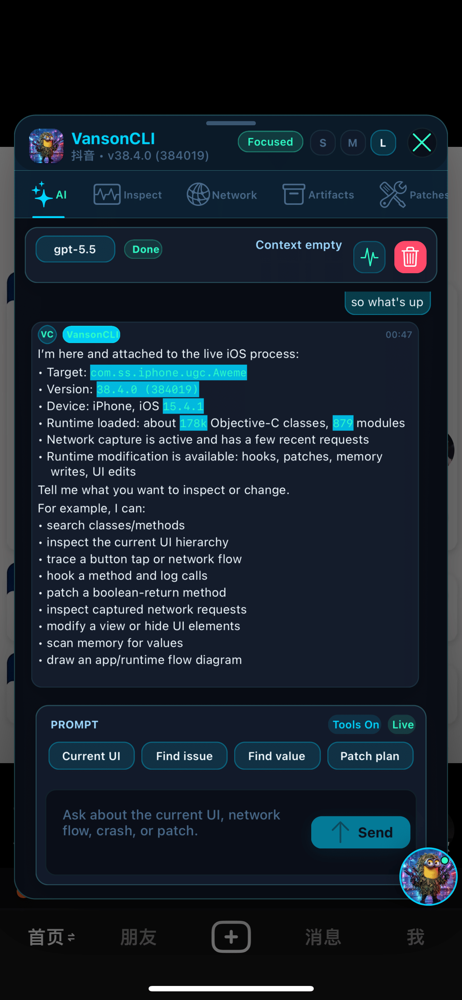
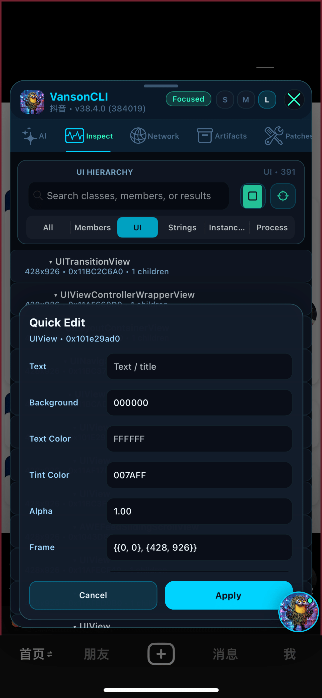
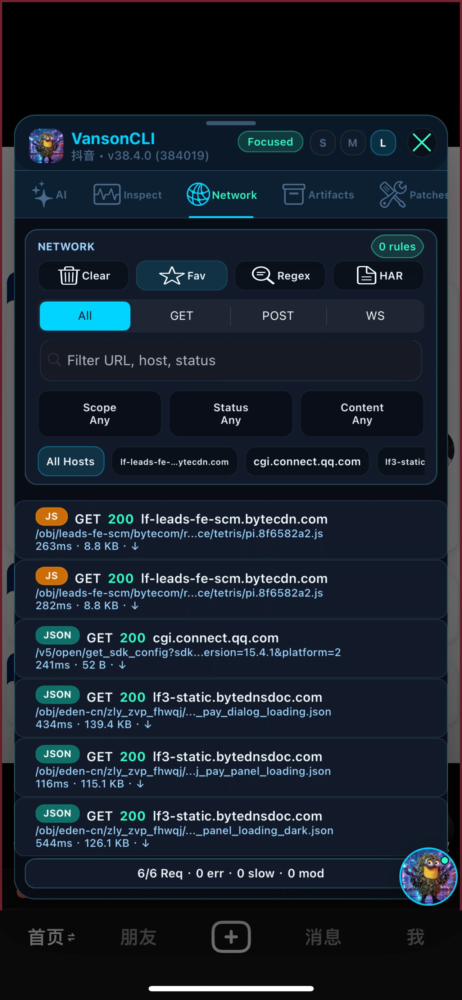
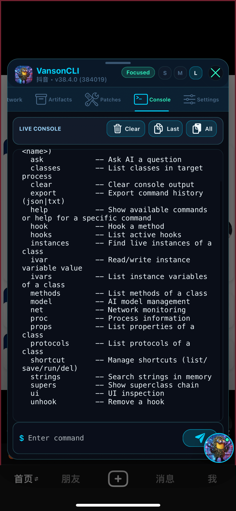
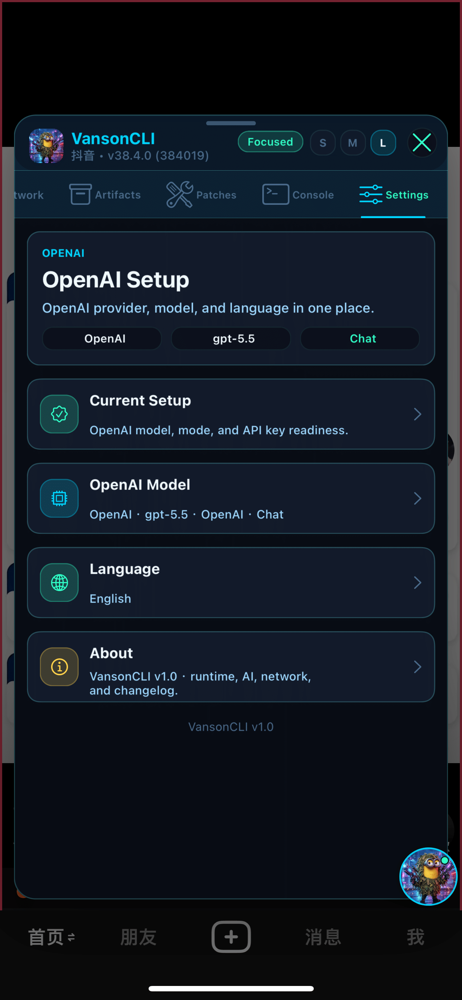

# VansonCLI


**面向授權測試環境的 iOS 注入式執行期工作台，整合 AI 輔助調試、UI 檢查、網路分析、記憶體工作流與補丁實驗能力。**

[English](../README.md) | [简体中文](./README_CN.md) | **繁體中文** | [العربية](./README_AR.md) | [Deutsch](./README_DE.md) | [Español](./README_ES.md) | [Français](./README_FR.md) | [日本語](./README_JA.md) | [한국어](./README_KO.md) | [Português](./README_PT.md) | [Русский](./README_RU.md) | [ไทย](./README_TH.md) | [Tiếng Việt](./README_VI.md)


> [](https://t.me/VansonCLI)

---

## 簡介

**VansonCLI** 會把被注入的 iOS 進程變成可即時檢查、查詢、編輯與操作的執行期工作台。它把 AI 對話、Objective-C 執行期探索、UIKit 控件選取、網路捕獲、記憶體掃描、補丁管理、Artifacts 與診斷資訊整合在一個緊湊懸浮面板中。

## 相容性說明

- **目標平台**：iOS 14.0+，arm64，MobileSubstrate 相容注入環境。
- **構建環境**：macOS、Theos、iOS arm64 目標工具鏈。
- **AI 提供商**：OpenAI-compatible Chat Completions / Responses、Anthropic、Gemini 與自訂相容提供商。
- **多語言支援**：簡體中文、繁體中文、English、العربية、Deutsch、Español、Français、日本語、한국어、Português、Русский、ไทย、Tiếng Việt。

## 頁面結構

- **AI 對話**：攜帶目前 App 上下文對話，執行 tool call，查看驗證結果與引用。
- **分析**：瀏覽 Objective-C 類、方法、成員變數、屬性、協議、字串、模組與活躍實例。
- **網路**：捕獲 HTTP/HTTPS/WebSocket 流量，查看格式化 headers/params/body，重放請求並匯出 HAR。
- **Artifacts**：查看截圖、日誌、工具輸出與診斷結果。
- **補丁 / 記憶體**：管理 Hook、數值補丁、網路規則、記憶體掃描與受控寫入。
- **設定**：管理 AI provider、端點模式、API 版本、API Key、角色預設、模型列表、Token 限制與推理深度。

## 功能亮點

- 為 AI 助手提供 UIKit、網路、執行期、記憶體、補丁與 artifacts 的結構化工具能力。
- 支援模型提供商編輯、模型獲取、測試調用和調用日誌。
- 支援觸摸選取控件、UI 層級檢查、view 屬性修改與 pick 高亮開關。
- 支援網路請求詳情 modal、行內編輯重放參數、收藏、規則、正則測試與 HAR 匯出。
- 支援緊湊氣泡、引用卡片、終止控制、可重試工具塊與上下文用量追蹤。

## 應用截圖


### 真機直向截圖

<table>
  <tr>
    <td align="center"></td>
    <td align="center"></td>
    <td align="center"></td>
    <td align="center"></td>
    <td align="center"></td>
  </tr>
</table>


## 構建與文檔

```bash
./scripts/build_release.sh
```

- [安裝說明](../INSTALL.md)
- [架構說明](./ARCHITECTURE.md)
- [安全說明](./SAFETY.md)
- [截圖說明](./SCREENSHOTS.md)
- [更新日誌](../CHANGELOG.md)

## 免責聲明

VansonCLI 僅用於合法測試、調試、學習和技術交流。請僅在你擁有或已獲授權測試的 App、設備、帳號和系統上使用。使用者需自行遵守法律、平台規則、App 條款和第三方服務條款。
